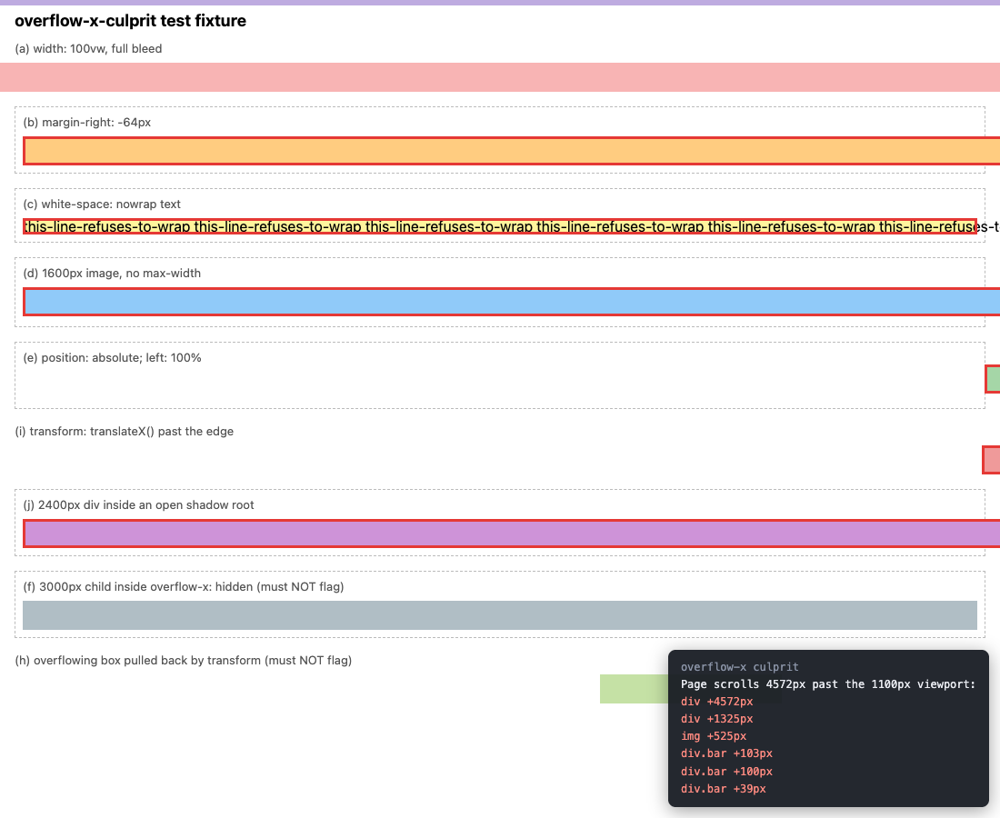

# Overflow-X Culprit

A Chrome extension that answers one question: **what is causing this horizontal scrollbar?**

Click the toolbar button. Every element that extends the page's scrollable area past the
right edge gets a red outline, a fixed overlay lists them with their overflow in pixels,
and a `console.table` gives you clickable handles to jump to each one in DevTools. The
badge shows the culprit count. Click again to clear everything.



## The gotchas it catches

The naive approach (walk all elements, flag anything whose `getBoundingClientRect().right`
exceeds `window.innerWidth`) misses or misreports most of the interesting cases. This
extension handles them:

- **`width: 100vw` on a page with a vertical scrollbar.** `100vw` includes the scrollbar,
  `window.innerWidth` includes it too, so naive scripts see nothing wrong. The real
  viewport edge is `document.documentElement.clientWidth`, which is what this measures
  against. This is the single most common cause of the mystery scrollbar.
- **Negative right margins** that widen a box past the edge.
- **`white-space: nowrap` text.** The element's own box is a normal width; only the raw
  text sticks out, so there is no child element to flag. Caught via `scrollWidth` on
  overflow-visible elements.
- **Absolutely-positioned elements** hanging off the right edge.
- **Transforms, measured the way Chrome actually scrolls.** Verified empirically (see the
  test harness): transformed bounds do extend the scrollable area, so a box translated
  past the edge is flagged, while a box whose layout position overflows but whose
  transform pulls it back inside is correctly left alone.
- **Open shadow roots** are traversed, so web-component internals get flagged too.

Just as important, it does not cry wolf:

- `position: fixed` elements (and their contents) never create page scroll, however wide.
- Anything inside an `overflow-x: hidden | clip | auto | scroll` ancestor causes container
  scroll at worst, not page scroll.
- Ancestor chains are deduped: you get the deepest element actually producing the
  overflow, not the whole tree above it.
- If `overflow-x: hidden` on `html` or `body` is already clipping the page (the classic
  band-aid), it says so instead of listing phantom culprits.
- No page-level overflow at all is reported cleanly.

While active it rescans on window resize (debounced) and clears stale outlines.
Highlights use `outline`, never `border`, so the highlighting cannot shift layout and
change the very overflow being measured.

## Install

Chrome Web Store listing coming. Until then, load it unpacked:

1. Clone this repo.
2. Open `chrome://extensions`, enable **Developer mode**.
3. Click **Load unpacked** and select the repo folder.

The extension uses only the `activeTab` and `scripting` permissions: it can touch a page
solely after you click the button on that page. No broad host permissions, no build step,
no runtime dependencies.

## Development

`content.js` is both the extension content script and the engine under test; the
`chrome.*` wiring is guarded, so the harness can inject the same file into a plain page.

```sh
npm install        # playwright is the only devDependency
npm test           # runs test/run.mjs against real Chrome, headless
npm run icons      # regenerate icons/ from the inline SVG
npm run screenshot # regenerate docs/screenshot.png
```

`test/fixture.html` contains labeled positive scenarios (100vw, negative margin, nowrap
text, oversized image, absolute positioning, transform-out, shadow DOM) and negative ones
that must not be flagged (clipped child, fixed element, transform-pulled-back). The
harness asserts the exact culprit set, the applied outlines, the overlay, resize
rescanning, and the clean no-overflow path.

One platform note: headless Chrome on macOS uses overlay scrollbars (0px wide), so the
`100vw` scenario genuinely does not overflow there; the harness measures the scrollbar
and asserts that case conditionally. On Windows and Linux, where scrollbars take layout
space, it is a true positive.
